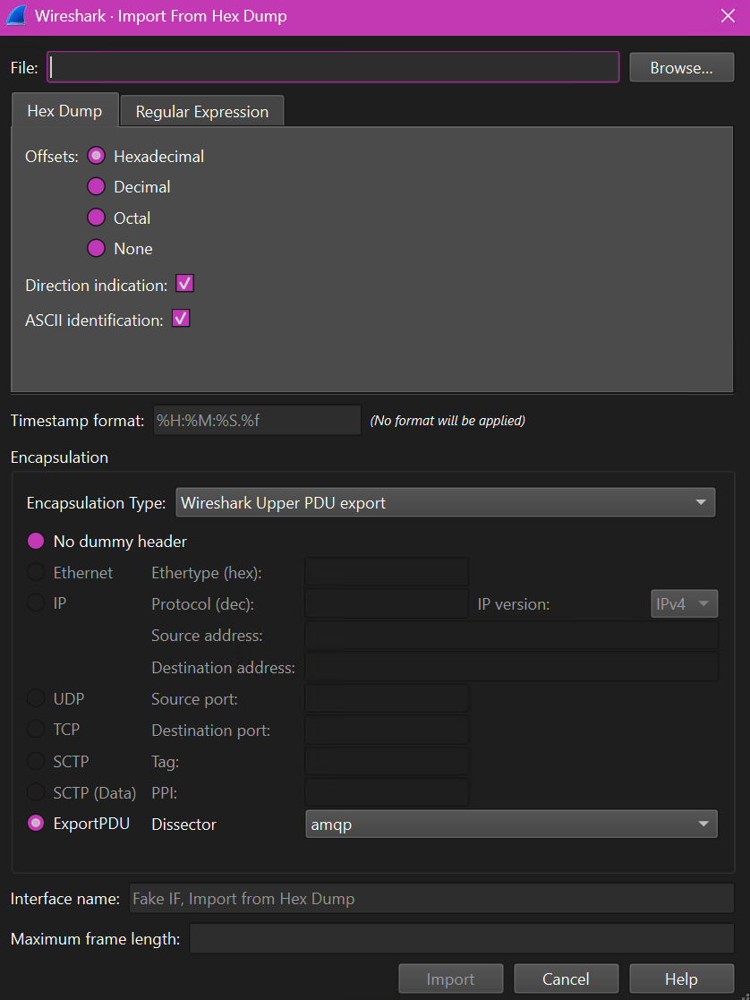

# Importing AMQP Proxy hexdumps into Wireshark

AMQP Proxy can write out Wireshark-compatible hexdumps. Unlike the display friendly JSON format, these dumps will
contain the actual type information for each field, without interpretation beyond the Wireshark AMQP dissector.

## Instructions

1. Start the AMQP proxy, with your usual flags, and add `--enable-hexdump-files <path to folder>`. AMQP proxy
   will write hexdump files into this folder. Note, you can write bin files and JSON files, they operate
   independently.
1. Connect your program to the proxy, as usual.
2. After your program completes, close the proxy and open up Wireshark.
3. Choose "File | Import from hex dump"
4. In the import dialog choose the following options:

   * Offsets: `Hexadecimal`
   * Direction indication: ✅
   * ASCII identification: ✅
   * Encapsulation Type: `Wireshark Upper PDU export`
   * Export PDU Dissector: `amqp`

   
5. Click OK

Wireshark will have a complete packet trace, with all AMQP data decoded.
